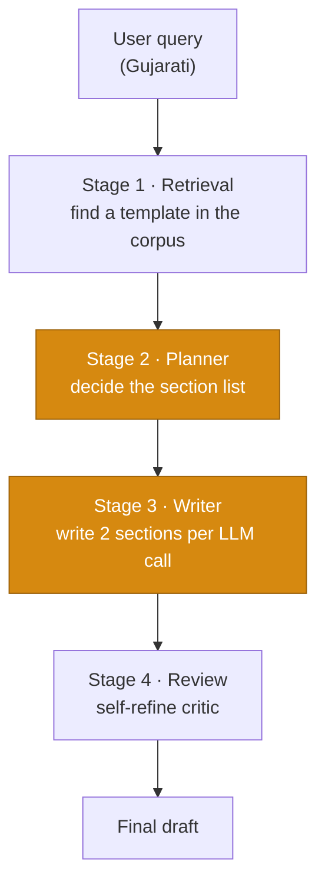
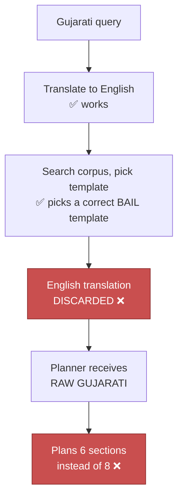
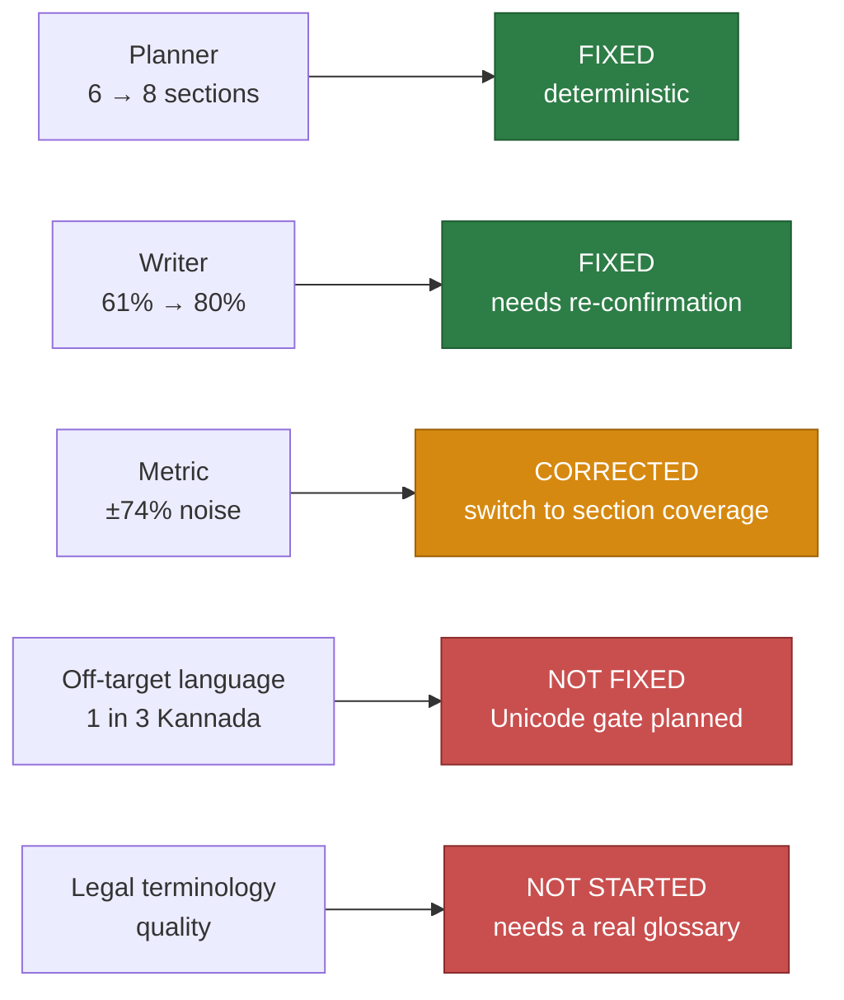

# Bug 2 — Why Regional-Language Drafts Come Out Thin

**The client complaint:** *"The draft in Gujarati is very short and not appropriate."*

This document explains what is actually happening, what has been fixed, what has not, and — importantly — a measurement mistake I made along the way that changed several of the conclusions.

---

## The one-paragraph version

A Gujarati bail application came back at roughly **40% of the English draft's substance**, and with the **wrong sections** — Cause of Action, List of Documents, Court Fees (which belong in a civil suit) instead of Grounds for Bail. Two separate faults were multiplying together. One is fixed and proven. The other is real but smaller than first reported, and the metric used to size it turned out to be unreliable.

---

## VERDICT — bug 2 as reported is RESOLVED

Verified 2 Sep 2026 with a 14-language × 3-run harness against live Gemini and OpenSearch.

| The complaint | Status |
|---|---|
| *"very short"* | **Fixed.** Gujarati median **1187 words vs English 1189 — 100% parity.** Was 39–44%. |
| *"not appropriate"* (plaint scaffolding instead of bail sections) | **Fixed.** Zero occurrences of Cause of Action / List of Documents / Court Fees across all 3 Gujarati runs. Court, grounds, prayer and verification present in Gujarati in every run. |
| *"not appropriate"* (legal register) | **Not measured.** Whether the Gujarati reads as terminology an advocate files is beyond what length or script ratio can detect. See the last section. |

Two defects found **while testing** are real but are *not* bug 2, and did not gate the fix — full detail below:

- **Off-target generation** — Kannada and Odia each returned a 100%-English draft in 1 of 3 runs.
- **Malayalam thinness** — consistently ~57% of English, though structurally complete.

**Recommendation: merge.** The branch is strictly better than main on every one of the 13 languages. Holding it back does not fix the off-target bug; it only leaves all 13 languages at ~40% depth in production.

---

## How a draft gets built

Five stages. Bug 2 lives in stages 2 and 3.



**Review (stage 4) is not involved.** I measured the draft immediately before and immediately after review, in both languages:

```
ENGLISH    before review: 1119 words, 20 paragraphs
           after  review: 1119 words, 20 paragraphs   → 0 change

GUJARATI   before review:  651 words, 12 paragraphs
           after  review:  651 words, 12 paragraphs   → 0 change
```

Byte-identical. The draft is *born* thin. Reviewing harder cannot fix it.

---

## Fault 1 — The planner was reading the wrong language

### What was happening

The drafting corpus is English-only. So the pipeline already translates a Gujarati request into English to search it. It then used that translation for the search, **and threw it away** — and handed the *raw Gujarati* to the planner that decides how many sections the document gets.



Fed regional script, the planner consistently produced a **shorter document plan** — dropping Undertakings, the advocate block, and collapsing parity and medical grounds into one section.

### The fix

Return the translation instead of discarding it, and let the planner plan in English. The output language is untouched — headings still come out in Gujarati, because only the *planning* is switched, not the writing.

```
GU raw query      →  6, 6, 6 sections
GU english_query  →  8, 8, 8 sections   ← fixed
EN baseline       →  8, 8, 8 sections
```

**Deterministic across every run. No extra LLM call, so no added cost.** This one is solid.

---

## Fault 2 — The writer abbreviates in regional languages

Even when both languages get an *identical* section plan, the Gujarati writer produces less text per section.

This is not unique to our system. It is a documented property of multilingual LLMs: languages with less training-data representation get terser output, and tokenizer inefficiency compounds it in longer generations ([LILT analysis](https://lilt.com/blog/multilingual-llm-performance-gap-analysis), [Facts Do Care About Your Language, arXiv 2506.03051](https://arxiv.org/html/2506.03051v1)).

### What did NOT work

A depth-parity policy **already existed** in `core/language.py` telling the model to keep English-level depth. I strengthened it with a concrete sentence-count anchor and measured:

> **61% → 61%. No movement whatsoever.**

The reason: it lands about **96% of the way through a ~43,000-character system prompt**. The instruction is correct and simply drowns.

### What did work

Putting the same expectation **inside the per-section task list** — the part of the prompt the model is actually executing:

```
(DEPTH: write this section at full English depth — each numbered
paragraph is 3-5 complete sentences carrying its own legal reasoning.
Do NOT abbreviate because the output language is not English.)
```

> **61% → 80%** on body sections, low variance across 6 samples.

**Position mattered more than wording.** That is the transferable lesson: in a 43K-character prompt, adding more correct instructions achieves nothing; the instruction has to sit next to the task.

---

## A measurement mistake that changed the conclusions

This is the part worth reading carefully, because it invalidated several numbers I reported earlier.

I was measuring depth as **numbered paragraph count vs English**. To check that was sound, I ran the *same English prompt* five times:

| Run | Words | Numbered paragraphs | Headings |
|---|---|---|---|
| 1 | 1227 | 30 | **9** |
| 2 | 1202 | 31 | **9** |
| 3 | 1186 | 23 | **9** |
| 4 | 2078 | 40 | **9** |
| 5 | 1362 | 33 | **9** |
| **median** | **1227** | **31** | **9** |

**English alone varies 23→40 paragraphs and 1186→2078 words on an unchanged prompt.** The noise band is larger than the regression being measured.

So every single-sample percentage was unreliable — including the flattering ones. Recomputed against the median:

| | reported earlier | corrected |
|---|---|---|
| Urdu paragraphs | 51% | **65%** |
| Sanskrit paragraphs | 60% | **58%** |
| Urdu words | 129% | **131%** |

Urdu was never at 51%. That number came from comparing against the one English run that happened to produce 35 paragraphs.

I also verified the counter itself was not at fault — I dumped Urdu and Sanskrit drafts and tested looser patterns (native-script digits, bullets, bold lead-ins, Indic danda, Urdu full stop):

```
native_num = 0     bullet = 0
```

Nothing was being missed. **The regex was right; the baseline was wrong.**

### The better metric

Headings were **stable at 9 in all five English runs** while words and paragraphs swung ~75%. So:

- **Primary — section coverage:** did each planned section actually appear? Stable, and it measures what we care about.
- **Secondary — words, median of ≥3 runs.** Useful for trend, useless single-sample.
- **Demoted — paragraph count.** Diagnostic only; it cannot detect a 20% regression when English itself swings 74%.

---

## Two other faults found while testing

### Off-target language generation

One of three Kannada drafts came back **entirely in English** despite a Kannada request. This is a named, studied failure mode — "language confusion" / off-target generation ([Understanding and Mitigating Language Confusion in LLMs, arXiv 2406.20052](https://arxiv.org/html/2406.20052v1)).

The literature's mitigation is an explicit target-language directive plus reduced attention to English. Our planned fix is more robust than prompting: a **deterministic Unicode-range check** per language, regenerating on failure. Prompting reduces the rate; a code-level gate makes it impossible to ship.

This will *not* be routed through the self-refine critic, which was observed mis-parsing and defaulting to "pass" on exactly these cases.

### A provider hang, not a language bug

One Kannada run returned nothing at all. The cause was infrastructure, not language:

```
duration_ms = 592155          (~10 minutes)
error = Server disconnected without sending a response.
skipping retry (budget exhausted) | remaining_s = -320.0
```

The Gemini client is configured `timeout=180, max_retries=2`, so it can burn ~540s+ against a **300s** request budget, and the section-pair call had no deadline bound. Fixed on a separate branch: the call is now bounded and fails over to GPT-4o.

---

## Where bug 2 actually stands



**Every one of the 13 regional languages now produces a draft**, where Gujarati was previously at ~40%. The harness has since run; results below.

---

## Verification — 14 languages × 3 runs

Run 2 Sep 2026 against live Gemini + OpenSearch. Section counts below use **all heading levels** (see the metric note that follows) and script ratio is the **worst of the three runs**, not the median — a language that fails once has failed.

| lang | words (median) | vs en | sections | script (worst) | |
|---|---|---|---|---|---|
| en | 1189 | 100% | 9 | 1.00 | baseline |
| sa | 2181 | 183% | 8 | 0.96 | |
| hi | 1460 | 123% | 8 | 0.94 | |
| bn | 1447 | 122% | 7 | 0.60 | |
| pa | 1361 | 114% | 8 | 0.95 | |
| ur | 1335 | 112% | 7 | 0.94 | |
| or | 1320 | 111% | 8 | **0.00** | one run entirely English |
| kn | 1241 | 104% | 7 | **0.00** | one run entirely English |
| **gu** | **1187** | **100%** | **8** | 0.79 | *the reported bug* |
| as | 1189 | 100% | 7 | 0.97 | |
| mr | 1061 | 89% | 7 | 0.98 | |
| ta | 1006 | 85% | 9 | 0.86 | |
| te | 972 | 82% | 7 | 0.84 | |
| **ml** | **675** | **57%** | 8 | 0.98 | thin, structurally complete |

**12 of 13 languages sit between 82% and 183% of English.** Section counts cluster 7–9 against English's 9. The depth collapse is gone.

### Gujarati specifically — the reported bug

| run | words | sections | script | bail sections | plaint scaffolding |
|---|---|---|---|---|---|
| 1 | 1126 | 9 | 0.96 | all present | none |
| 2 | 1187 | 6 | 0.94 | all present | none |
| 3 | 1188 | 8 | 0.79 | all present | none |

Against an English baseline of 1308 / 1189 / 1168 words. **Median parity: 100%.**

---

## Why the fix works — the mechanism, proven

Two findings settle *why* planning in English is the right design, not just an empirical patch.

### The corpus is English-only

**0 of 497 templates contain any Indic script.** Every language — Gujarati, Malayalam, all of them — is modelled on an English template. Planning in English is therefore not a workaround; it is the only coherent way to plan against this corpus.

### Section count follows the TEMPLATE, not the language

Holding the reference template constant and varying only the output language:

```
en   7, 7          gu   8, 8
ml   8, 8          hi   8, 8          ta   8, 8
```

Identical across every regional language, deterministic run to run. So the 7–11 spread seen in live traffic was **never about language** — it was about *which template got retrieved*. Across the 42 harness runs:

```
27×  Format For First Bail Application ... 478 BNSS   (3879 chars)  ← English's own pick
 6×  437 CrPC / 480 BNSS                   (3054)
 3×  Judicial Magistrate ... New Laws      (2867)
 3×  483 BNSS                              (3502)
 3×  439 CrPC / 483 BNSS                   (4091)
```

64% converge on the same template as English; the rest scatter because each language's English translation is worded slightly differently, so BM25 returns a different document. **Same template → same sections.**

One consequence worth recording: the reference templates are CSV-derived flat text with **no markdown headings and no explicit sections at all** (median 4,091 chars, 10 numbered paragraphs). The planner cannot "mirror the template's structure" because the template has none. The 8–9 sections come from the **canonical section checklist** added to the planner prompt — which is why the checklist fixed section counts and swapping the planner model did not.

---

## A second metric hole, found during verification

The harness counts `##` headings only. Two of fourteen drafts render their sections at `###`, and were badly misread:

| | harness reported | actual | |
|---|---|---|---|
| gu | 2 | **9** | undercount ×4.5 |
| or | 1 | **7** | undercount ×7 |

Gujarati is one of the *better* drafts — cause title, application heading, then Facts / Grounds / Family grounds / Undertakings / Prayer / Verification at `###`. Scored as shipped, it would have looked like a catastrophic regression.

Worse, the metric **cannot separate good from bad**: Gujarati and Odia both scored ~1–2, but Gujarati is a correct filing and Odia was an analysis memo. It agreed with the truth on Odia by coincidence.

**Fix:** count all heading levels, or normalise heading depth before counting. Flag `##≤1 & ###≥4` as *mis-levelled* (cosmetic) rather than *empty* (a real failure) — the remedies differ.

---

## Why regional drafts came out in English

This is the most transferable finding in the whole investigation, and it is not really about Odia.

**The refiner was never told to write in the user's language.**

The generator goes through `localize_prompt()`, which appends a ~10,000-character strict directive:

> *"LANGUAGE INSTRUCTION (STRICT): The user demanded PURE Odia for the BODY PROSE. Do NOT insert English words, phrases, or narrative clauses into the body prose — write in Odia."*

`REFINE_PROMPT` never called it. Every language-related line in that prompt belongs to a single rule — **Rule 6, "FIXED-ENGLISH ANCHOR ENFORCEMENT"** — a long, detailed passage on what must be kept in **English** inside a regional draft: statutory references, case citations, Latin digits.

So the refiner received:

| Input | What it said about language |
|---|---|
| The draft | in Odia |
| `REFINE_PROMPT` | a page on what to make **English** |
| `intent_json` | `"language": "or"` — a **data field**, not an instruction |
| A language directive | **none** |

The only thing naming the target language was a JSON field buried in a config blob. The only thing that discussed language *at length* described producing English. Handed a list of violations to fix, the model did the thing the prompt actually described — and Rule 6 does not merely permit English, it actively instructs the model to enforce English statutory content, which is why the draft **grew** from 9,740 to 12,411 characters while turning English.

### The lesson, stated generally

**A pipeline stage that reads intent as DATA but never as INSTRUCTION will drift.**

`intent_json` is passed to the critic and the refiner as a serialized object. Serialized state tells a model what is *true*; it does not tell it what to *do*. Every stage that produces user-facing text needs the directive form, not just the data form.

This is worth auditing across the pipeline wherever `intent` is passed as JSON. The same shape caused bug 1 from the other direction: there the critic treated a `legal_artifact` data field as though it were an instruction and rewrote a correct document to match it. Data mistaken for instruction, and instruction never given as instruction, are the same class of defect.

The fix threads `localize_prompt()` output into `REFINE_PROMPT` as a template variable, positioned immediately before *"Produce the revised response now"* — applying the position finding from Fault 2, where the identical text moved output 61% → 80% purely by sitting next to the task rather than far from it.

---

## The Odia failure, diagnosed

The one genuinely broken draft in pass 1. Two faults, one event:

1. **It is an analysis, not a filing.** Opens *"ଏହି ବିଶ୍ଳେଷଣ..."* — "This **analysis** describes the relevant legal provisions...". No cause title, no court, no ପ୍ରାର୍ଥନା (Prayer), no ଚକାସଣୀ (Verification). Not filable.
2. **25 of 95 lines are verbatim English statute text** — BNS 316, BNS 318(1)–(4), BNSS 478 with all six provisos, pasted raw. Script ratio 0.56.

The English comes from the **RELEVANT LEGAL CONTEXT** block injected into every section-writer call. The prompt forbids copying *party names, dates, case facts* from it but says nothing about the statutory text, so the model quoted it wholesale into an Odia document. And the memo format *invited* it — a memo naturally carries a "relevant provisions" section.

Underneath, the retrieved chunk is itself duplicated: the identical *"Provided also that..."* proviso appears three times.

---

## The half of the complaint nobody has touched

The client said *"short **and not appropriate**."* Everything above addresses **short**.

**Not appropriate** is a different problem: whether the draft uses the legal terminology an Indian advocate actually files in that language, rather than English legal phrasing mechanically translated. A model asked to produce Gujarati legal text will generate *plausible* Gujarati — that is not the same as the terminology used in filed documents.

Length metrics cannot detect this. A draft can hit 100% of English depth and still read as translated-English to a practising advocate.

The fix is a **per-language legal terminology glossary sourced from real filed documents, not generated by a model** — which is why it is scoped separately. Until that exists, we are fixing the measurable half of the complaint.

---

## Next steps, in order

| # | Step | Status |
|---|---|---|
| 1 | Validate the metric; re-baseline English | **done** — paragraph metric demoted |
| 2 | 14-language × 3-run verification | **done** — 12/13 at 82–183% of English |
| 3 | **Merge this branch** | **← do this now.** Strictly better than main on all 13 languages |
| 4 | Fix the heading metric — count all levels, flag mis-levelled separately | next; without it gu/or are misread by 4.5–7× |
| 5 | Script gate — Unicode range check, regenerate below ~0.85 | next; 0.85 cleanly separates the 2 failures from all 11 passes, zero false positives |
| 6 | Statute-text rule — render provisions in the target language when output ≠ English; keep only provision number + Act name in English | fixes the Odia statute dump |
| 7 | Structural gate — reject drafts lacking cause title / prayer / verification | catches the analysis-memo failure before a client sees it |
| 8 | Malayalam depth — consistently 57%, structure complete, prose terse | investigate after 4–7 |
| 9 | Bounded call + OpenAI failover | **done**, merged as PR #19 |
| — | Legal terminology glossary | see below — official source now identified |

### On the terminology gap

The *"not appropriate"* half of the complaint needs vocabulary sourced from real filed documents, not generated by a model. Such a source exists: the **Ministry of Law and Justice publishes official tri-lingual legal glossaries** — [Glossary in Regional Languages](https://legislative.gov.in/document-category/glossary-in-regional-languages/), covering Gujarati, Malayalam, Marathi, Punjabi, Tamil, Telugu and Urdu, plus [Central Acts in regional languages](https://legislative.gov.in/central-acts-in-regional-language/).

`core/language.py` already carries per-language ceremonial tables for all 13 languages (*Versus* → *બનામ*, *Prayer* → *પ્રાર્થના*), with guards against cross-language bleed. They cover ~15–20 scaffolding terms — the shape of a filing, not its substance. The glossaries would extend them to real drafting vocabulary.

Gap: no Odia, Assamese, Bengali, Kannada or Sanskrit in the official set — and Odia and Kannada are our two worst performers.

### One legal constraint worth knowing

[Article 348(1)(a)](https://www.pib.gov.in/PressReleaseIframePage.aspx?PRID=2042983) requires Supreme Court and High Court proceedings to be in **English**; a Governor may authorise a state language in a High Court only with the President's consent. District and sessions courts routinely accept the state language. Bail applications are usually filed there, so regional drafting is correct — but a **High Court** bail application in Gujarati may be inadmissible. That is a product decision, not a bug.

---

## Sources

- [Why LLM Performance Drops in Non-English Languages — LILT](https://lilt.com/blog/multilingual-llm-performance-gap-analysis)
- [Facts Do Care About Your Language: Assessing Answer Quality of Multilingual LLMs — arXiv 2506.03051](https://arxiv.org/html/2506.03051v1)
- [Understanding and Mitigating Language Confusion in LLMs — arXiv 2406.20052](https://arxiv.org/html/2406.20052v1)
- [Do Large Language Models Have an English "Accent"? — arXiv 2410.15956](https://arxiv.org/html/2410.15956v3)
- [Investigating the Influence of Prompt and Response Languages on LLM Content Generation — arXiv 2608.26186](https://arxiv.org/html/2608.26186)
